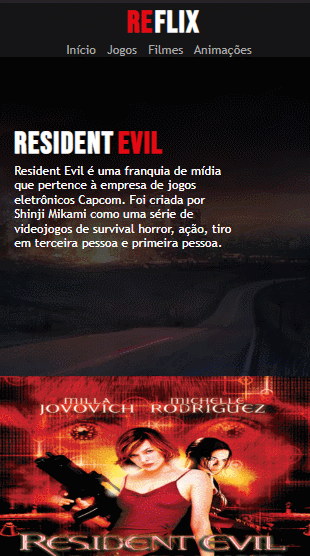

# Reflix

<h4 align="center"> 
	🔴⚪ Reflix ⚪🔴
</h4>

## 💻 Sobre o projeto

Projeto feito com html, css e javascript com intuito de colocar em prática os que estou aprendendo no bootcamp Localiza Labs React Developer, na Digital Onovation One

O projeto consiste em recriar uma parte de uma possível plataforma de streaming sobre o universo dos filmes de Resident Evil.

---

## ⚙️ Funcionalidades
- [x] Usar o carrossel para procurar um filme e escolhê-lo
- [x] Assistir ao trailer do filme escolhido

---
 

## 💻 Demosntração

---

## 🛠 Tecnologias

As seguintes ferramentas foram usadas na construção do projeto:

-  HTML
-  CSS
- JavaScript
- Jquery

---